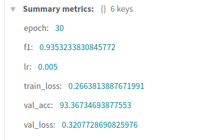
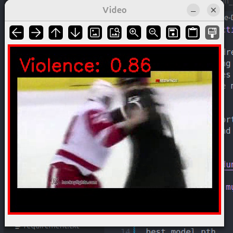

# Violence-Detection-use-MobileNetV2-BiLSTM-ATTENTION

This project addresses the task of **video-based violence detection** using deep learning. Spatial features are extracted from video frames with  **MobileNetV2** , while temporal dependencies are modeled using a  **Bi-directional LSTM (BiLSTM)** .

The system supports stable video inference with confidence visualization and output video saving.


## SUMMARY



---

## Cấu trúc thư mục

```text
model.py              # Định nghĩa model (MobileNetV2 + BiLSTM)
inference.py          # Script inference trên video
best_model.pth        # Trọng số model đã huấn luyện
requirements.txt      # Danh sách thư viện cần thiết
check_vid.py          # Test video demo inference
qua_trinh_train.ipynb # Train model trên Colab
archive/
└── data/             # Video test demo (khác dữ liệu train/val)
assets/
└── demo.png          # Ảnh minh hoạ inference
README.md

**Nếu muốn có trọng số best_model.pth thì chạy file colab, duoi day la huong dan inference:**
```
## Cài đặt môi trường

### 1 Clone repository

```bash
git clone https://github.com/dungyta/-violence-detection-use-MobileNetV2-BiLSTM-ATTENTION.git
cd project_violence
```

### 2 Tạo môi trường ảo (khuyến nghị)

```bash
conda create -n violence python=3.10
conda activate violence
```

### 3 Cài đặt thư viện

```bash
pip install -r requirements.txt
```

---

## Chạy inference

Chạy phát hiện bạo lực trên một video:

```bash
python inference.py
```

Video kết quả sẽ được lưu tại:

```text
output_violence_demo.mp4
```

check demo in output_violence_demo.mp4

---


## Chi tiết inference

* Mỗi clip gồm **16 frame liên tiếp**
* Model xuất ra xác suất bạo lực (confidence)
* Áp dụng **EMA** để làm mượt confidence theo thời gian
* Ngưỡng phát hiện bạo lực mặc định:

```python
THRESHOLD = 0.55
```

---

## Ghi chú

* VS Code không hỗ trợ xem trực tiếp file `.avi`, vui lòng dùng VLC hoặc OpenCV, use check_vid.py

---

---

**Authur**

**Vũ Xuân Dũng- HUST UNIVERSITY**
